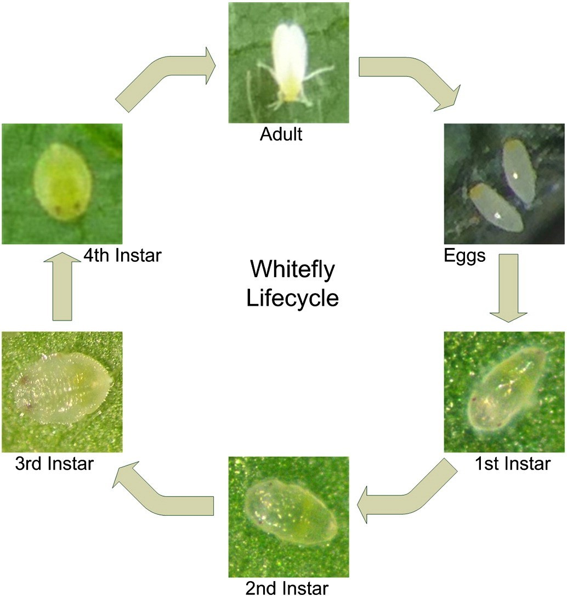
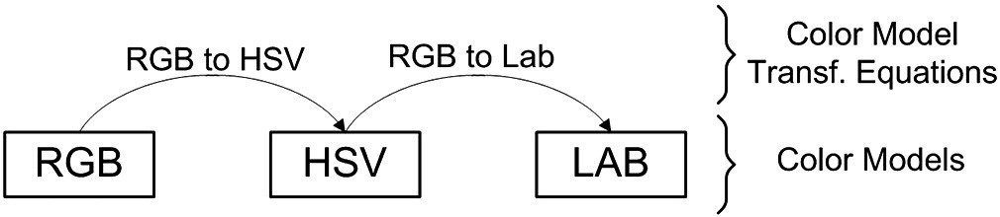

# DIP-Project-Identify-Whiteflies-on-Crop-Leaves

In this project we have followed the digital image processing methods outlined in the research paper called "Using digital image processing for counting whiteflies on soybean leaves " to identify and count different stages of white flies on crop leaves.    The Whitefly is a type of airborne insect that harm various types of crops like soybean, bean, cassava by feeding on plant sap which causes them to fall off. The following image shows the lifecycle of the whitefly.

  

Since whiteflies have different characteristics in different stages of their lifecycle. We can use digital image processing methods to idenfity and count whiteflies at various stages.

## The methods outlined in the research paper
There are two methods outlined.
1. Simple Color Transformation  
2. Chaining Color Transformations

### 1. Simple Color Transformation
In this method the RGB image is converted to another color format and from that a single channel or a operation on channels is extracted for further inspection. The following list shows color transformations used to highlight different lifecycle stags.

- from RGB subtract blue channel from green channel ---------> discriminate nymphs and exo skeletons
- convert RGB to CMYK and extract k channel -----------------> both adult whiteflies and nymphs
- convert RGB to CIELAB and extract b channel ---------------> empty exo skeletons and wings appear dark
- convert RGB to HSV and extract H channel ------------------> nymphs and abdomens of adults appear dark

### 2. Chaining Color Transformations
In this method multiple color transformations applied one after another, to reveal new information not visible in original images.
But this cannot be done simply tansforming one after another because resulting image will be equal to a direct transformation from original image to the last transformation.
Therfore it has to be done in the following way.

  

In this example RGB is converted to HSV normal way. But in the second step, to convert HSV to CIELAB the **RGB to CIELAB method was used instead**.
So using the above method color transformation chaining was done to identify the whitefly stages in the following way.

- Nymphs: RGB --> LAB --> XYZ (third channel Z was considered)
- Adult whiteflies: RGB --> XYZ --> XYZ --> CMYK (first channel C was considered)
- Exoskeletons: RGB --> CMYK --> XYZ (third channel Z was considered)
- Leaf Leisions and Fungi: RGB --> LAB --> CMYK (second channel M was considered)

### But before applying color chaining we have to adjust histogram of the original image, because lighting conditions may change threshold values in the thresholding step.
For the thresholding rules suggested by the researchers, the original images peak of the green channel was located at the value of 140. So to change the peak of the green channel to 140, we have added the **difference between current peak value of green channel from 140** to all pixels of all channels of the image.

## Thresholding
After adjusting histograms and then applyng color chaining methods given above. The thresholding was applied to seperate areas of intesests from each color transformed image for nymphs, adults, exoskeletons, and leisions & fungi. The following are the thresholding rules. Consider p the pixel value.

- Nymphs: 230 < p white / else black
- Adult whiteflies: 13 > p  white / else black
- Exoskeletons: 64 > p  white / else black
- Leaf Leisions and Fingi: 128 > p  white / else black

## Removing invalid objects from thresholded images
After thresholding is done all objects in thresholded images smaller than 10% of the size of the largest object is removed.

## Counting objects in each image
Connected component analysis or contour detection can be used to count each individual object which corresponds to each whitefly adults or growth stages.

##### This is the youtube link for the full video:  https://youtu.be/oMZeE4iG0ek
##### This is the youtube link for the demonstration of the application ony:  https://youtu.be/oMZeE4iG0ek
##### Find the source code inside dipproject directory.
##### Find the executable file here: https://drive.google.com/drive/folders/1gLfm5QyQ5jG9BKmkHq66DOrH-DoQxq4x?usp=sharing
##### Please note that you will need images directory with the content inside it in the same directory as the whiteflies.exe executable to run this program.
 
